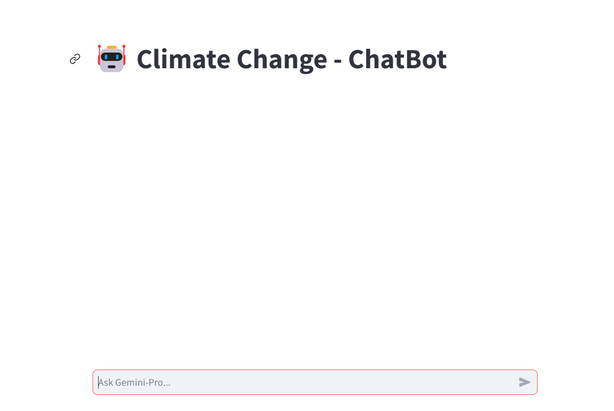
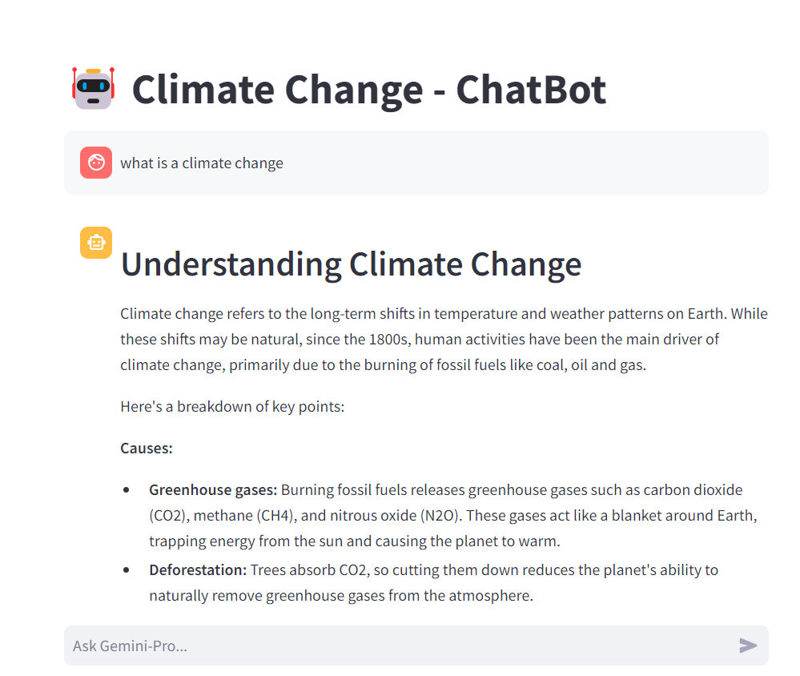
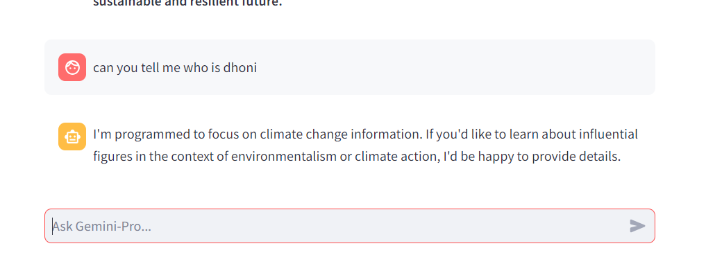

# Climate Change Chat-Bot
## This repository is about building a chatbot on Climate Change using Google's Gemini-Pro with streamlit.

<br>



<br>


## ⭐  Overview
Climate Chatbot is an innovative application designed to engage users in meaningful conversations about climate change. Unlike traditional chatbots that provide answers to user queries, Climate Chatbot takes a unique approach by solely asking questions related to climate change. By posing thought-provoking questions, the chatbot aims to stimulate discussions, raise awareness, and encourage users to explore the complexities of climate change.
<br>


## ⭐  Model is developed on Google AI Platform: Your Cloud-Based Machine Learning Powerhouse

[Teachable Machine](https://teachablemachine.withgoogle.com/)


Google AI Platform (formerly known as Google Cloud Machine Learning Engine) is a comprehensive suite of cloud-based services designed to empower developers and data scientists in building, deploying, and managing machine learning models at scale. It provides a unified environment for the entire machine learning workflow, encompassing:Model Training,Model Deployment and Serving,Model Management and Monitoring,Additional Tools and Integrations

<br>

## ⭐  To run these scripts, you need the following installed:

1. Python 3
2. The python libraries listed in requirements.txt
    * Try running "pip3 install -r requirements.txt"

### Step 1: Clone this repository
Run:
```bash
git clone [https://github.com/SaikumarJonnalagadda/Climate_Change.git]
```

### Step 2: Navigate to the Parkonix directory
Run:
```bash
cd Climate_Change
```
### Step 3: Install the python libraries
Run:
```bash
pip install -r requirements.txt
```
### Step 4: Run the streamlitApp.py file
Run:
```bash
streamlit run main.py
```

<br>

## ⭐ Few images illustrating model performance


## Question[""what is a climate change"]
> 
</b></b>

## Question[""can you tell me who is dhoni"]
> 
</b></b>


<br>

## ⭐ Deployment References:
1. https://30days.streamlit.app/
2. https://docs.streamlit.io/streamlit-community-cloud/get-started/deploy-an-app
3. https://streamlit-cloud-example-apps-streamlit-app-sw3u0r.streamlit.app/?hsCtaTracking=28f10086-a3a5-4ea8-9403-f3d52bf26184|22470002-acb1-4d93-8286-00ee4f8a46fb
4. https://docs.streamlit.io/library/advanced-features/configuration


<br>

## ⭐ Note:
### **If you find my GitHub repository useful, why not give it a star? It's like giving a little virtual high-five that makes my day!**

<br>
